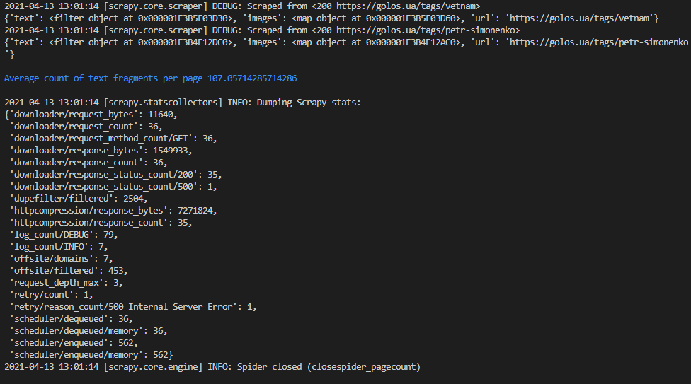
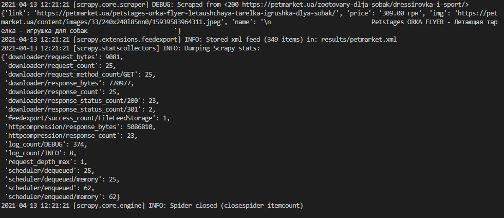
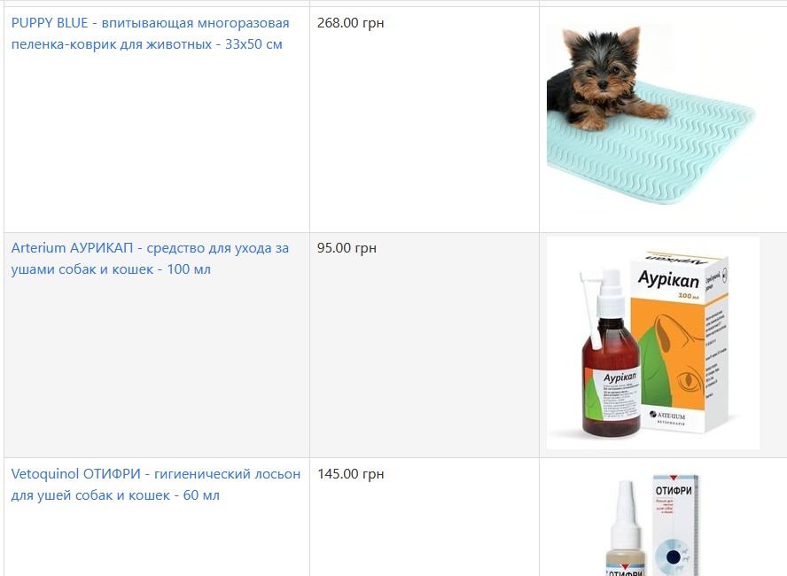

# Лабораторна робота №1. Козак Микола КП-81
# Тема: "Вивчення базових операцій обробки XML-документів"
### Варіант 8
### Завдання 1: [golos.ua](https://golos.ua)
### Завдання 2: Середня кількість текстових фрагментів
### Завдання 3: [petmarket.ua](https://petmarket.ua)

## Результат виконання парсингу сторінки [golos.ua](https://golos.ua)

## Результат виконання парсингу сторінки [petmarket.ua](https://petmarket.ua)

## Результат перетворення файлу з даними petmarket.xml в XHTML сторінку за допомогою мови XSLT 

